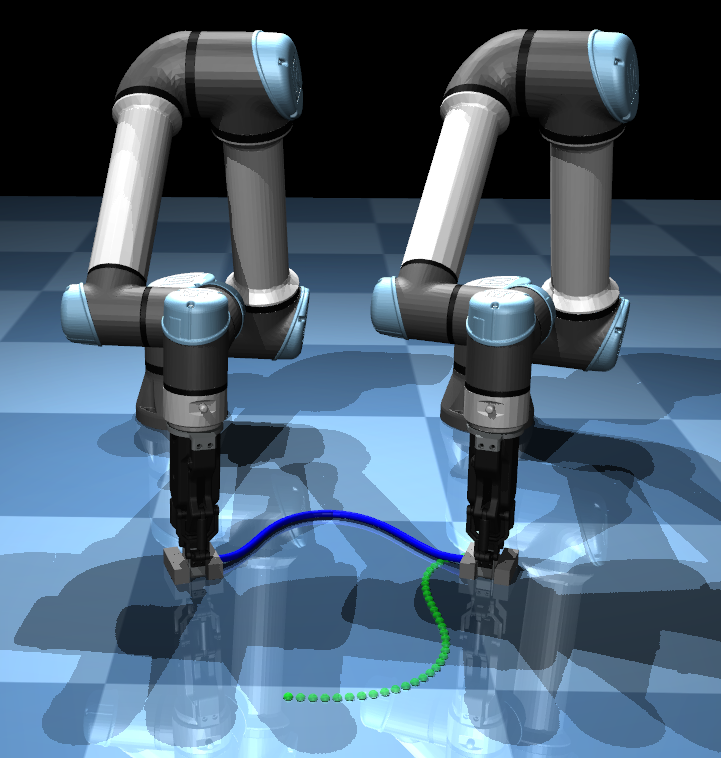

# UR5e Reinforcement Learning Environment

This is a Gym-formatted reinforcement learning environment designed for training policies for manipulating Deformable Linear Objects (DLOs). It provides a practical platform for tackling a major project in a deep reinforcement learning course.
<div align="center">
    
</div>

## Installation

### Requirements

This environment requires the following packages:

- mujoco >= 3.1.4
- dm-control >= 1.0.18
- numpy
- gymnasium

You can install these dependencies using the following command:

```bash
pip install mujoco dm-control numpy gymnasium
```

## Usage

To run the example, use the following command:

```bash
python ur5e_demo.py
```

## Environment Details

### Observation Space

The observation is a (42, 2) array, representing the 2D positions of 40 DLO nodes and 2 endpoints.

### Action Space

The action is a six-dimensional vector, with the first three dimensions controlling the XY translation and Z-axis rotation of the first robotic arm, and the last three dimensions controlling the second robotic arm. The valid range for actions is TODO.

### Reward

The reward is the negative of the DLO positional error. An additional bonus of 0.5 is given if the task is completed.

### Done

The task is considered complete if the DLO positional error is less than 0.005 meters.

### Info

If 500 steps are taken without task completion, the episode is truncated due to timeout.

## Reset

The `reset(seed)` function takes a seed (0-4), representing five different DLO target initial conditions.

## Additional Details

+ The positional error of the DLO is quantified as the root mean square (RMS) of the Euclidean distances between corresponding points of the actual and target configurations. 
$\text{RMS Error} = \sqrt{\frac{1}{n} \sum_{i=1}^n (d_i^2)}$
where $ d_i $ is the Euclidean distance between the $i$-th pair of actual and target points, and $ n $ is the total number of point pairs.

- The setup involves two UR5e arms and AG95 grippers operating on a flat surface. The DLO is simulated as a 0.5-meter line with 40 segments, rendered in blue, with its ends fixed to the gripping blocks. 
- To increase the operational space, collisions between the UR5e arms themselves are disabled, but collisions between grippers, gripping blocks, and the DLOs are retained.


# UR5e Reinforcement Learning Environment

这是一个gym格式的强化学习环境，用于我们DLO操作策略的训练，基于此，我们将对付《深度强化学习》这门课程的大作业。

## Installation

### Requirements

- mujoco >=3.1.4
- dm-control >=1.0.18
- numpy
- gymnasium

你可以通过以下命令安装这些依赖：

```bash
pip install mujoco dm-control numpy gymnasium
```

## Usage

你可以通过以下命令运行示例：

```bash
python ur5e_demo.py
```

## Environment Details

### Observation Space

Observation是一个（42，2）数组，表示DLO的40个节点和2个末端的二维位置。

### Action Space

Action是一个6维向量，前三维表示一号机械臂的xy平动和绕z轴旋转量，后三维则为二号机械臂。动作的合理范围TODO。

### Reward

Reward是DLO误差的相反数。若任务完成，则额外增加0.5。

### Done

若DLO误差低于0.005m，则任务完成。

### Info

若执行500步依然未完成，则超时截断。

## Reset

reset(seed)：seed0-4，代表五种不同的DLO目标。

## Additional Details

- DLO位置误差的计算方式是取42个点与42个目标点欧氏距离的均方根。
- 双臂为ur5e，夹爪为AG95，平面操作。DLO为40节的一段线，总长度为0.5m，渲染为蓝色，末端与抓取块固连。目标DLO位置为40个离散特征点，渲染为绿色。
- 为了增加操作空间，ur5e与ur5e之间的碰撞被取消，但手爪与手爪之间、抓取块与抓取块之间，DLO之间的碰撞被保留